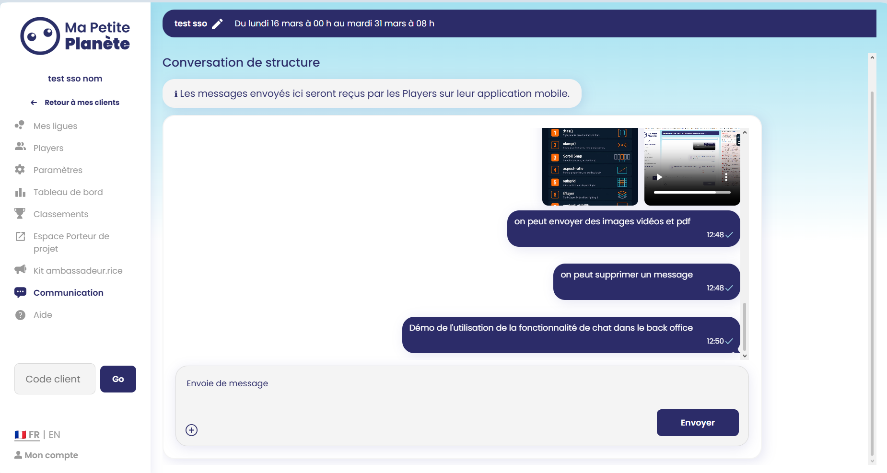

# 🔧 Chat en temps réel

> Fonctionnalité de chat en temps réel permettant aux porteurs de projets* et aux équipes internes de dialoguer avec l'ensemble de la structure sur l'application.

*Les porteurs de projets sont les personnes, chez les clients, chargées de piloter le jeu au sein de leur structure.
---

## 📌 Contexte

Cette feature a été développée afin de permettre aux porteurs de projets ou aux équipes internes de communiquer facilement et directement avec l'ensemble des joueurs, ce chat étant accessible en lecture seule sur l'application. Durant l'été 2025, notre développeur en charge de l'application mobile à ce moment là a développé le chat de ligue sur cette dernière. Afin de compléter cette épique de chat, j'ai, avec un collègue, travaillé sur cette fonctionnalité côté backoffice.

Cette fonctionnalité comporte :
- l'envoi de messages texte, images, PDF et vidéos
- la suppression de messages
- l'ajout de réactions aux messages
- l'affichage de l'état d'envoie du message
- le renvoir du message en cas d'erreur
- l'affichage des médias dans l'input
- chargement des anciens messages au scroll

Pour cette fonctionnalité, j'ai participé à l'envoi de messages côté front, réalisé la edge function qui gère l'enregistrement en base de données des messages, ainsi que le stockage des images, vidéos et PDFs dans le storage, l'affichage des médias dans l'input, la suppression de messages avec les médias ainsi que l'affichage de l'état d'envoi d'un message

- **Projet** : Backoffice entreprise
- **Équipe** : en binôme avec Eric
- **Période** : Novembre 2025 - Janvier 2026

---

## 🖼️ Visuels

<video controls src="../../screenshots/chat_2.mp4" title="vidéo de suppression d'un message" alt="vidéo de suppression d'un message"></video>
<video controls src="../../screenshots/chat_3.mp4" title="vidéo d'envoi d'un message" alt="vidéo d'envoi d'un message"></video>

---

## 🎯 Objectif

La fonctionnalité devait permettre de faciliter la communication avec les joueurs afin de dynamiser le jeu, effectuer des rappels et transmettre des informations importantes, que ce soit de la part des porteurs de projet ou des équipes internes.

---

## 🗺️ Flow / Structure

Pour cette fonctionnalité, on se concentre sur la partie envoi des messages, images, PDFs et vidéos. Concernant la structure globale, on dispose en base de données d'une table `chat_message` sur laquelle on active le Realtime de Supabase afin de s'abonner aux ajouts et modifications des messages. On a également une table `chat_message_attachment` qui sert à relier un média à un message et à stocker ses métadonnées (taille, type, nom, etc.).

1. L'utilisateur arrive sur la page de communication où il dispose d'un encadré pour le chat et d'un input pour envoyer des messages. Il peut rédiger son message, sélectionner des médias, puis envoyer via le bouton dédié ou la touche Entrée.

2. À l'arrivée sur la page, on déclenche une RPC pour récupérer les 15 derniers messages et on s'abonne aux changements sur la table `chat_message` pour le `chat_id` et le `group_id` (la structure cliente) concernés.

3. Pour ajouter des médias, on utilise un input de type file. À la sélection des fichiers, plusieurs vérifications sont effectuées : le nombre maximum de fichiers autorisés (5), le type de fichier via une détection par magic bytes, et la taille des fichiers (vidéo → 100 Mo, autres (images, PDF...) → 10 Mo). Si l'une de ces vérifications échoue, un message d'erreur correspondant est affiché, sinon les fichiers sont stockés dans un state.

4. Lorsque l'utilisateur déclenche l'envoi, on récupère la liste des médias s'il y en a, et on forme des objets de type `Attachment` en extrayant les métadonnées des images (`width`, `height`) et des vidéos (`duration`, `width`, `height`). On forme ensuite un objet de type `Message` pour le texte et on y attache les `Attachments`, puis on appelle la fonction `sendChatMessage`.

5. La fonction `sendChatMessage` récupère le message et traite les PDFs séparément selon certaines conditions : si le message contient plusieurs PDFs, ou un PDF accompagné d'autres médias, chaque PDF est extrait et placé dans un nouveau message vide qui lui est dédié (1 PDF = 1 message*).
En revanche, si le message ne contient qu'un seul PDF sans autre média, celui-ci reste attaché au message original.

6. Tous ces messages (l'original et ceux ne contenant qu'un PDF) sont ajoutés à un tableau `sendingMessagesList`. Pour chacun, on appelle la edge function chargée d'enregistrer les messages en base de données et les médias dans le storage. Le message est également ajouté immédiatement à la liste locale s'il n'y figure pas déjà.

7. En parallèle, l'abonnement aux changements sur la table `chat_message` permet de détecter en temps réel les messages envoyés par d'autres utilisateurs. À chaque nouvel événement, on récupère les informations du message, on le transforme en objet de type `Message`, on récupère ses éventuels attachments en base de données, on les transforme en objets `Attachment`, on les rattache au message, puis on l'ajoute à la liste locale s'il n'y est pas déjà.

*C'est un choix produit défini en amont par notre lead dev et product owner.

---

## 🏗️ Architecture & choix techniques

- **Stack utilisée** : Supabase Realtime, Edge Functions, React, Next.js
- **Edge function** : La edge function extrait les données du `formData` de la requête et effectue les mêmes vérifications que côté front. Elle vérifie d'abord le nombre de médias joints au message, si celui-ci dépasse 5, elle renvoie une réponse 400 avec un message d'erreur. Elle récupère ensuite les médias et vérifie pour chacun son type via une détection par magic bytes ; tout fichier dont le type n'est pas autorisé est écarté et ne sera pas enregistré en base de données. Le message texte, s'il existe, est ensuite inséré dans la table `chat_message`, et les informations des médias dans `chat_message_attachment`, via une RPC. Les fichiers médias sont enfin uploadés dans le storage. Une réponse est alors renvoyée pour confirmer l'envoi, et une fonction est déclenchée pour envoyer une notification.

---

## ⚠️ Difficultés rencontrées

Deux difficultés principales ont été rencontrées : un manque d'informations en amont et des problèmes de performance à l'envoi.

Concernant la première, nous n'avons appris que tardivement dans le développement que les PDFs devaient être rattachés à des messages distincts. Cette information manquante nous a obligés à revoir une partie de la logique en fin de développement, ce qui fut frustrant. Cela dit, le code était suffisamment modulaire pour que l'adaptation se fasse sans trop de difficultés. Ce point a été soulevé en rétrospective.

Concernant la seconde, la lenteur ne venait pas tant de l'envoi du message en lui-même que des vérifications de sécurité effectuées côté front et côté edge function. Pour y remédier, nous avons décidé de limiter le nombre de fichiers autorisés et de rejeter les fichiers trop volumineux le plus tôt possible dans le processus. Une piste que nous n'avons pas explorée aurait été d'envoyer d'abord le message texte immédiatement, puis de gérer l'upload des médias en arrière-plan avant de mettre à jour le message concerné.

---

## ✅ Résultat

Le chat remplit bien sa fonction : il permet de dynamiser le jeu et de prévenir rapidement les joueurs. Je ne dispose pas de métriques précises à ce sujet.